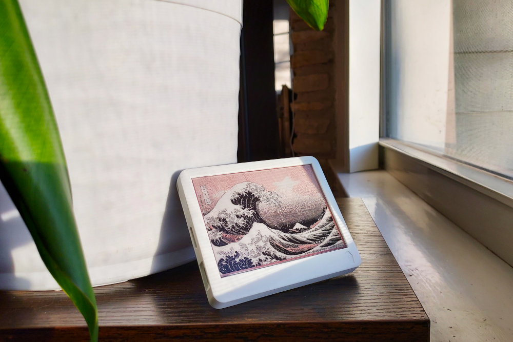

# Art Slideshow
This example displays random images from a SD card.



## Usage

### Creating images
Get any image and crop/resize to 400x300px using tools like gimp, photoshop, etc. 
Use [image_converter tool](https://github.com/paperdink/image_converter) to convert the image into bitmap format
that Paperdink can use.

### SD card

Get a 32GB or less SD card and format to FAT32. 
Rename all the bitmaps (.bmp files) created in previous step to the format `Art_(num).bmp`. 
Copy these images onto the root of the sd card. Meaning the images should not be in any subfolder on the SD card. 
See the images folder for examples. 
Insert SD card into the Paperdink device and upload the code.

### Update `config.h`
```
/* CONFIGURATION
 * Uncomment only one of the below #define statements
 * based on the paperd.ink device you have
 */
//#define PAPERDINK_DEVICE Paperdink_Classic
#define PAPERDINK_DEVICE Paperdink_Merlot

#define UPDATE_INTERVAL 5 // Update interval in mins. Suggest to use atleast 5 mins.
#define NUM_IMAGES 5 // Number of images uploaded. Used for selecting a random number.
```

