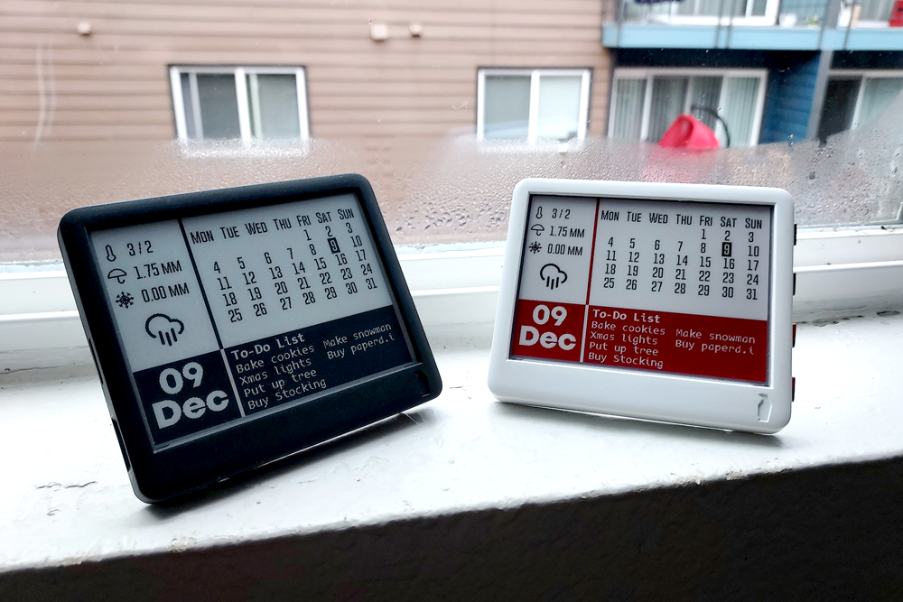

# Calther
This example displays a calendar along with weather and todo list.
Todo list can be synced from [Taiga](https://www.taiga.io) or [Todoist](https://todoist.com) and weather from [Openweathermap](https://www.openweathermap.org)



## Usage

### Getting Openweathermap API key
From their [website](https://openweathermap.org/appid),

The API key is all you need to call any of our weather APIs.
Once you [sign up](https://openweathermap.org/home/sign_up) using your email,
the API key (APPID) will be sent to you in a confirmation email.
Your API keys can always be found on your [account page](https://home.openweathermap.org/api_keys),
where you can also generate additional API keys if needed. 
Check our [documentation page](https://openweathermap.org/api)
to find all technical information for each product. 
Documentation is an essential guide with actual examples and 
comprehensive description of API calls, responses and parameters.

### Todo list from Taiga
First create an account on [Taiga](https://www.taiga.io) and create a new project.
Add your login details and project name to the config file.

### Todo list from Todoist
First create an account on [Todoist](https://www.todoist.com).
Go to `Settings > Integrations` and generate an API token.
Copy this token to the config file.

### Refresh
The refresh can be controlled by the the following two lines. (Only un-comment one of the lines.)
- Line 1: For lower current consumption, it is possible to wake-up only after a specific period of time defined by the variable `sleep_time`.
- Line 2: For better control, it is possible to configure a button to trigger a wake-up in addition to a specific time period, but this leads to slightly higer current usage.

```
  /* Update after sleep_time microsecond or when button 1 is pressed. */
  // Paperdink.deep_sleep_timer_wakeup(sleep_time*S_TO_uS_FACTOR); // Consumes lower current
  Paperdink.deep_sleep_timer_button_wakeup(sleep_time*S_TO_uS_FACTOR, BUTTON_1_PIN); // Consumes higher current
```

### Update `config.h`

Update the `config.h` file with configuration details

```
/* CONFIGURATION
 * Uncomment only one of the below #define statements
 * based on the paperd.ink device you have
 */
#define PAPERDINK_DEVICE Paperdink_Classic
//#define PAPERDINK_DEVICE Paperdink_Merlot

#define SSID     "*****" // Wifi Network SSID (name of wifi network)
#define PASSWORD "*****" // Wifi Network password

/* Time zone from list https://github.com/nayarsystems/posix_tz_db/blob/master/zones.csv */
#define TIME_ZONE "PST8PDT,M3.2.0,M11.1.0"

/* Number of times to update starting 12am
 * 1 = Updates every 24 hours
 * 2 = Updates every 12 hours
 * 3 = Updates every 8 hours. Not a good idea since it won't align with day changes.
 * 4 = Updates every 6 hours
 * ... and so on
 * Higher number means lower battery life
 */
#define UPDATES_PER_DAY 4

/* Weather information */
#define CITY    "*****" // City for weather
#define COUNTRY "*****" // Country for weather
#define OWM_ID  "*****" // Open weather map APP ID
#define UNITS   "M"     // M for metric (celsius), I for Imperial (fahrenheit)

/* To-Do list config
 * Select Todo list provider between Taiga or Todoist
 * by uncommenting their respective lines.
 */
/* Todoist configuration */
//#define TODOIST (true)
//#define TODOIST_TOKEN "Bearer *****" // Todoist Token

/* Taiga configuration */
#define TAIGA (true)
#define TAIGA_PROJECT_USERNAME  "*****" // Taiga username
#define TAIGA_PROJECT_PASSWORD  "*****" // Taiga login password
#define TAIGA_PROJECT_NAME      "*****" // Taiga project name
```
