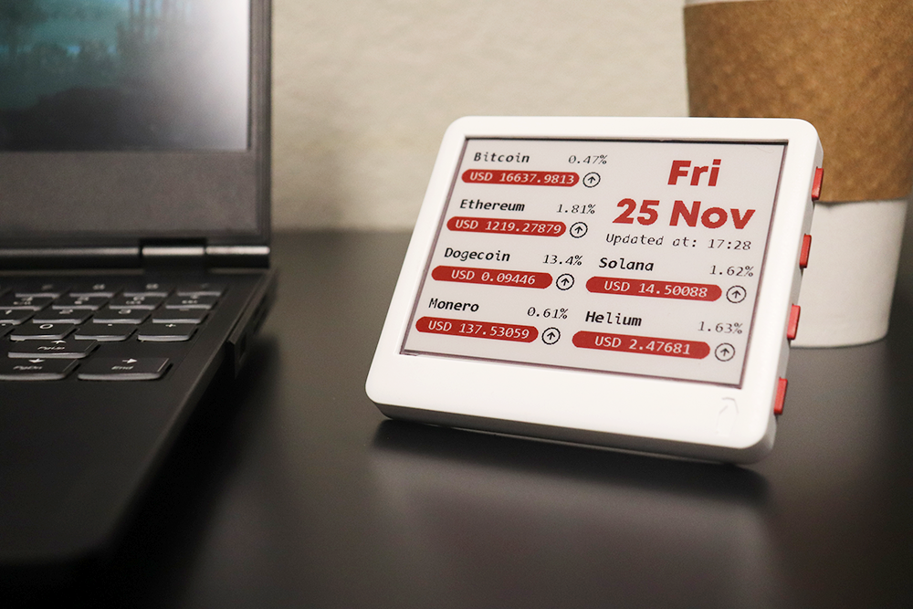

# Cryptocurrency Tracker
This example displays 6 crypto tickers with their price and percentage change.
It also shows the date and time it was updated.



## Usage

### Fetch crypto ticker
Visit [coingecko](www.coingecko.com) and search for the ticker you like.
Open the ticker page and note the **API id** field. This string is the ticker string
to be copied in the configuration file.

### Device wake-up
The refresh can be controlled by the the following two lines. (Only un-comment one of the lines.)
- Line 1: For lower current consumption, it is possible to wake-up only after a specific period of time defined by the variable `sleep_time`.
- Line 2: For better control, it is possible to configure a button to trigger a wake-up in addition to a specific time period, but this leads to slightly higer current usage.

```
  /* Update after sleep_time microsecond or when button 1 is pressed. */
  // Paperdink.deep_sleep_timer_wakeup(sleep_time*S_TO_uS_FACTOR); // Consumes lower current
  Paperdink.deep_sleep_timer_button_wakeup(sleep_time*S_TO_uS_FACTOR, BUTTON_1_PIN); // Consumes higher current
```

### Update `config.h`

Update the `config.h` file with configuration details

```
// CONFIGURATION
// Uncomment only one of the below #define statements
// based on the paperd.ink device you have
#define PAPERDINK_DEVICE Paperdink_Classic
//#define PAPERDINK_DEVICE Paperdink_Merlot

#define SSID     "*****" // Wifi Network SSID (name of wifi network)
#define PASSWORD "*****" // Wifi Network password

// Time zone from list https://github.com/nayarsystems/posix_tz_db/blob/master/zones.csv
#define TIME_ZONE "PST8PDT,M3.2.0,M11.1.0"

// Number of times to update starting 12am
// 1 = Updates every 24 hours
// 2 = Updates every 12 hours
// 3 = Updates every 8 hours. Not a good idea since it won't align with day changes.
// 4 = Updates every 6 hours
// ... and so on
// Higher number means lower battery life
#define UPDATES_PER_DAY 4

#define CRYPTO_TICKER_1 "Bitcoin"
#define CRYPTO_TICKER_2 "Ethereum"
#define CRYPTO_TICKER_3 "Dogecoin"
#define CRYPTO_TICKER_4 "Monero"
#define CRYPTO_TICKER_5 "Solana"
#define CRYPTO_TICKER_6 "Helium"
```
