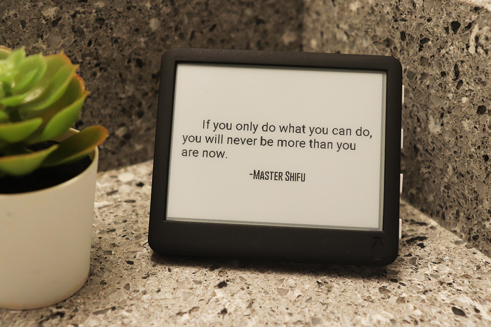

# Quotes

This example displays quotes fetched from [quotable](https://github.com/lukePeavey/quotable).



### Device wake-up

The refresh can be controlled by the the following two lines. (Only un-comment one of the lines.)

- Line 1: For lower current consumption, it is possible to wake-up only after a specific period of time defined by the variable `sleep_time`.
- Line 2: For better control, it is possible to configure a button to trigger a wake-up in addition to a specific time period, but this leads to slightly higher current usage.

```c
  /* Update after sleep_time microsecond or when button 1 is pressed. */
  // Paperdink.deep_sleep_timer_wakeup(sleep_time*S_TO_uS_FACTOR); // Consumes lower current
  Paperdink.deep_sleep_timer_button_wakeup(sleep_time*S_TO_uS_FACTOR, BUTTON_1_PIN); // Consumes higher current
```

## Usage

### Update `config.h`

Update the `config.h` file with configuration details.
You don't really need to change anything other than selecting paperd.ink device, WiFi details and Time zone.
Other configuration is provided to make it easy to change font.

```c
/* CONFIGURATION
 * Uncomment only one of the below #define statements
 * based on the paperd.ink device you have
 */
#define PAPERDINK_DEVICE Paperdink_Classic
//#define PAPERDINK_DEVICE Paperdink_Merlot

#define SSID     "*****" // Wifi Network SSID (name of wifi network)
#define PASSWORD "*****" // Wifi Network password

/* Time zone from list https://github.com/nayarsystems/posix_tz_db/blob/master/zones.csv */
#define TIME_ZONE "America/Los_Angeles"

/* Number of times to update starting 12am
 * 1 = Updates every 24 hours
 * 2 = Updates every 12 hours
 * 3 = Updates every 8 hours. Not a good idea since it won't align with day changes.
 * 4 = Updates every 6 hours
 * ... and so on
 * Higher number means lower battery life
 */
#define UPDATES_PER_DAY 4

/* Quote tags (categories). For options, see https://api.quotable.io/tags */
#define QUOTE_TAGS "" // Empty means include all quote categories
// | separator -> OR multiple categories
//#define QUOTE_TAGS "technology|film|future|famous-quotes|science"
// comma separator -> AND multiple categories (may result in 0 hits)
//#define QUOTE_TAGS "business,change"

/* Configuration below this is if you want to change the font.
 * Each font size is different, hence tuning the margins and line height
 * is required. Additionally, smaller fonts can accommodate longer quotes.
 */
#define QUOTE_FONT &Roboto_Regular12pt7b
#define AUTHOR_FONT &Gobold_Thin9pt7b

#define MAX_QUOTE_LENGTH 256   // Maximum characters in a quote
#define MAX_AUTHOR_LENGTH 128  // Maximum characters in a author

#define FIRST_LINE_MARGIN 55   // Margin to leave on the left for the first line (in pixels)
#define QUOTE_MARGIN_LEFT 18   // Margin to leave on the left of the quote 2nd line onwards (in pixels)
#define QUOTE_MARGIN_RIGHT 18  // Margin to leave on the right of the quote (in pixels)

#define EXPECTED_LINE_CHARS 40 // Maximum expected characters in a line
#define LINE_HEIGHT_FACTOR 30  // Dividing string length with this to get number of lines
```
